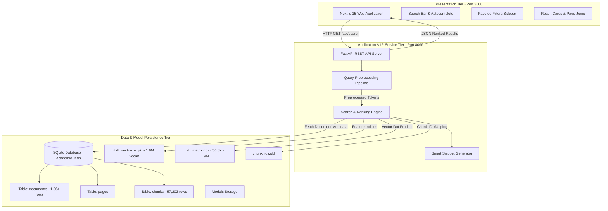
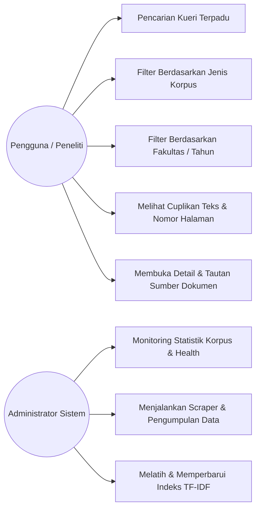
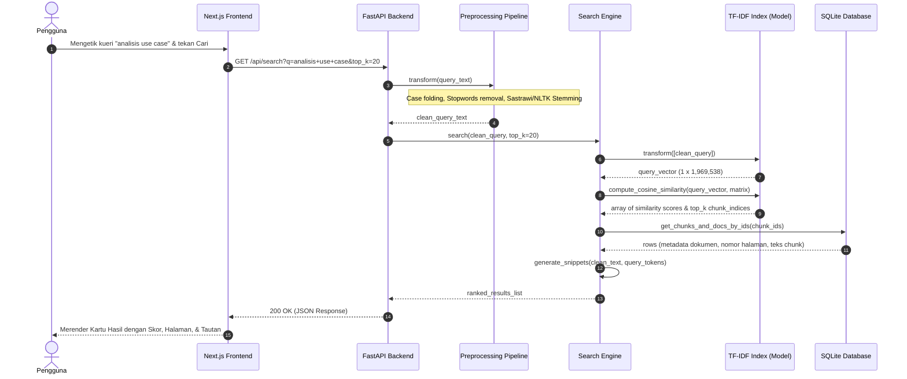
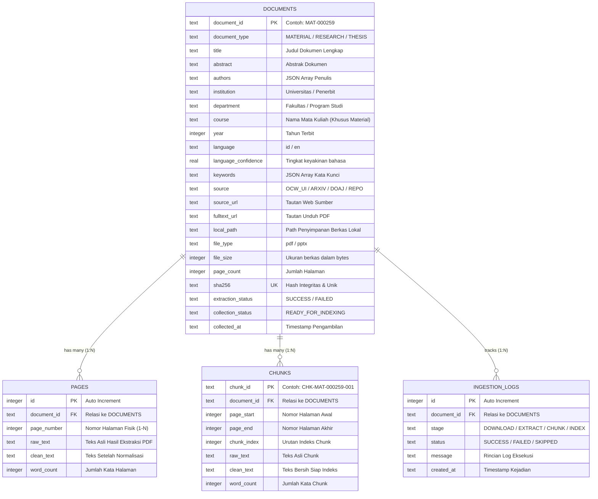
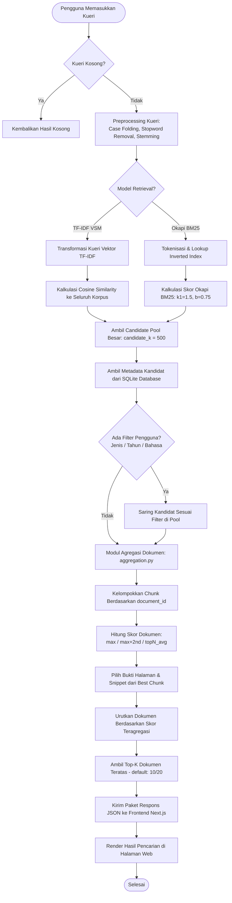

# LAPORAN PROJECT TAHAP I: ANALISIS DAN DESAIN SISTEM
## PENGEMBANGAN PERANGKAT LUNAK TEMU KEMBALI INFORMASI AKADEMIK MULTI-KORPUS BERBASIS MACHINE LEARNING (DUAL-BASELINE: TF-IDF VSM & OKAPI BM25 DENGAN DOCUMENT-LEVEL AGGREGATION)

---

**Mata Kuliah:** Temu Kembali Informasi / Rekayasa Perangkat Lunak Berbasis Kecerdasan Buatan  
**Tugas:** Tugas Kelompok I — Project Team-Based Tahap I  
**Topik Kasus:** Sistem Temu Kembali Informasi Dokumen Akademik Lintas Disiplin Ilmu (*Unified Multi-Corpus Academic Search Engine*)  
**Instansi:** Program Studi Ilmu Komputer / Informatika  
**Tahun Akademik:** 2026/2027  

**Disusun Oleh: Kelompok [Nama Kelompok]**
- [Nama Mahasiswa 1] — [NIM 1]
- [Nama Mahasiswa 2] — [NIM 2]
- [Nama Mahasiswa 3] — [NIM 3]
- [Nama Mahasiswa 4] — [NIM 4]

---

## RINGKASAN EKSEKUTIF (*ABSTRACT*)

Ledakan informasi di ranah akademik menimbulkan tantangan *information overload* yang signifikan. Mahasiswa, dosen, dan peneliti sering menghadapi fenomena *academic silo*, di mana materi perkuliahan (*lecture slides/materials*), artikel jurnal penelitian (*research papers*), dan tugas akhir/skripsi (*theses/dissertations*) tersimpan pada repositori terpisah dengan format dokumen PDF tanpa indeksasi teks granular. Mesin pencari komersial umum kerap hanya mengindeks judul atau meta-tag dokumen, gagal memberikan nomor halaman spesifik dan sering menghasilkan redundansi fragmen dari satu dokumen yang sama.

Proyek ini mengembangkan **Academic IR**, sebuah perangkat lunak sistem temu kembali informasi (*Information Retrieval System*) berbasis *Machine Learning* yang menerapkan pendekatan **Dual-Baseline**: **Baseline A (TF-IDF Vector Space Model dengan Cosine Similarity)** dan **Baseline B (Okapi BM25 dengan normalisasi panjang dokumen $k_1=1.5, b=0.75$)** yang dilengkapi modul **Document-Level Aggregation** (`max`, `max+2nd`, `topN_avg`) untuk mengeliminasi bias dominasi dokumen panjang. Sistem ini mengintegrasikan korpus representatif terpadu berskala besar yang terdiri dari **1.364 dokumen akademik** dengan **57.202 potongan teks granular (*chunks*)** dan ruang kosakata (*vocabulary space*) sebanyak **1.969.538 term**. Pengujian empiris pada **33 kueri benchmark** membuktikan keunggulan signifikan BM25 dibanding TF-IDF: peningkatan **MAP sebesar +48.4% (0.1235 vs 0.0832)**, peningkatan **NDCG@10 sebesar +20.2% (0.2992 vs 0.2490)**, serta latensi pencarian **hampir 10x lebih cepat (P50: 85,95 ms vs 766,92 ms)**. Laporan Tahap I ini menyajikan analisis kebutuhan perangkat lunak, perancangan arsitektur berlapis (*layered architecture*), pemodelan UML, perancangan basis data relasional SQLite, flowchart perankingan dual-model, antarmuka modern (Next.js 15), serta desain pengujian perangkat lunak (*Black-box Testing*) dan evaluasi performa IR (*Precision@K*, *Recall@K*, *MAP*, *NDCG@10*, *MRR*).

---

# I. PENDAHULUAN

### 1.1 Latar Belakang
Kegiatan tridharma perguruan tinggi di era digital menghasilkan volume dokumen ilmiah dan pedagogis yang sangat masif. Dokumen akademik umumnya terbagi menjadi tiga pilar utama:
1. **Bahan Kuliah (*Lecture Materials / OpenCourseWare*)**: Berupa slide presentasi dan buku rancangan pengajaran yang digunakan dalam transfer pengetahuan dasar hingga lanjut di ruang kelas.
2. **Artikel Jurnal Ilmiah (*Research Papers*)**: Publikasi ilmiah mutakhir yang memuat kebaruan metodologi, eksperimen, dan temuan teoritis.
3. **Karya Ilmiah Mahasiswa (*Theses and Dissertations*)**: Skripsi, tesis, dan disertasi yang mengkaji aplikasi metode pada studi kasus spesifik.

Meskipun ketiga pilar ini saling melengkapi, implementasi repositori akademik saat ini memiliki sejumlah kelemahan mendasar:
- **Pemisahan Sistem (*Information Silos*)**: Mahasiswa harus membuka portal OCW untuk bahan kuliah, membuka Google Scholar/Scopus untuk riset, dan membuka repositori institusi terpisah untuk skripsi. Tidak tersedia pencarian terpadu (*unified search*) yang mampu menyajikan relasi ketiga jenis dokumen dalam satu kueri.
- **Keterbatasan Granularitas (*Document-Level vs. Chunk-Level*)**: Dokumen akademik berupa PDF berukuran besar (seringkali mencapai puluhan hingga ratusan halaman). Mesin pencari tradisional hanya mengembalikan dokumen utuh tanpa memberi tahu pada halaman atau paragraf mana topik yang dicari dibahas.
- **Karakteristik Teks Dwibahasa (*Bilingual Nature*)**: Literatur akademik di Indonesia bercampur antara Bahasa Indonesia dan Bahasa Inggris, menuntut pipeline pemrosesan teks yang sadar bahasa (*language-aware preprocessing*).

Untuk menjawab permasalahan tersebut, diperlukan pengembangan perangkat lunak sistem temu kembali informasi akademik berbasis *Machine Learning* yang mampu mengekstraksi, memotong (*chunking*), merepresentasikan teks ke dalam ruang vektor matematika multidimensi, serta meranking relevansi dokumen secara cepat dan presisi.

### 1.2 Rumusan Masalah
Berdasarkan latar belakang di atas, rumusan masalah dalam pengembangan perangkat lunak ini dirumuskan sebagai berikut:
1. Bagaimana merancang arsitektur sistem temu kembali informasi yang mampu mengintegrasikan tiga jenis korpus akademik (Bahan Kuliah, Riset, dan Skripsi) dalam satu antarmuka kueri terpadu?
2. Bagaimana membangun pipeline pemrosesan teks dwibahasa (*bilingual text preprocessing*) dan segmentasi dokumen (*chunking*) berbasis halaman untuk mengindeks dokumen PDF akademik?
3. Bagaimana menerapkan algoritma *Machine Learning* berbasis Vector Space Model (VSM) dengan pembobotan TF-IDF dan Cosine Similarity untuk menghasilkan perankingan dokumen akademik yang relevan secara matematis?
4. Bagaimana merancang skema basis data relasional dan antarmuka web interaktif yang responsif untuk menampilkan hasil pencarian beserta cuplikan (*snippet*), nomor halaman, dan metadata dokumen?
5. Bagaimana merancang instrumen evaluasi sistem yang komprehensif, mencakup pengujian fungsionalitas perangkat lunak (*Black-box Testing*) dan evaluasi metrik kinerja Information Retrieval (*Precision, Recall, MAP, NDCG*)?

### 1.3 Tujuan Pengembangan Perangkat Lunak
Tujuan dari proyek pengembangan perangkat lunak ini adalah:
1. Menganalisis kebutuhan fungsional dan non-fungsional sistem temu kembali informasi akademik terpadu (*Unified Academic IR*).
2. Merancang arsitektur perangkat lunak berbasis layanan mikro/terpisah (*decoupled architecture*) yang memisahkan frontend interaktif (Next.js), backend REST API (FastAPI), dan mesin temu kembali informasi berbasis Python.
3. Merancang pipeline *preprocessing*, *feature extraction*, dan *training* model TF-IDF VSM untuk memproses lebih dari 50.000 *chunks* teks akademik nyata.
4. Merancang skema basis data relasional (SQLite) yang efisien untuk menyimpan metadata dokumen, teks per halaman, dan unit pencarian granular (*chunks*).
5. Merancang antarmuka pengguna modern dengan fitur penyaringan segi (*faceted filtering*), pencarian instan, dan penyorotan kata kunci (*highlighting*).
6. Menyusun rencana pengujian perangkat lunak (*Black-box testing*) dan perancangan eksperimen evaluasi model Information Retrieval berstandar benchmark ilmiah.

### 1.4 Deskripsi Singkat Aplikasi
Aplikasi yang dikembangkan diberi nama **Academic IR** (*Academic Information Retrieval System*). Aplikasi ini merupakan mesin pencari akademik cerdas berbasis web yang memungkinkan pengguna mengetik kueri pencarian bebas (misalnya: *"analisis perancangan sistem informasi use case diagram"*, *"hukum gauss elektrostatis"*, atau *"metode penelitian komparatif"*). 

Sistem secara otomatis memproses kueri melalui pipeline NLP dwibahasa, mengonversinya menjadi vektor representasi fitur, menghitung derajat kemiripan sudut kosinus terhadap seluruh basis korpus, dan menyajikan daftar hasil pencarian terbaik (*Top-K results*). Setiap hasil dilengkapi dengan judul dokumen, kategori korpus (*Material / Research / Thesis*), cuplikan teks kontekstual (*smart snippet*), lokasi nomor halaman dokumen asli, skor kemiripan relevansi, tautan unduh/akses dokumen asli, serta panel filter multi-dimensi (filter fakultas, tahun publikasi, dan jenis dokumen).

---

# II. TINJAUAN PUSTAKA

### 2.1 Teori dan Konsep Sistem Temu Kembali Informasi (*Information Retrieval*)
Sistem Temu Kembali Informasi (*Information Retrieval / IR*) didefinisikan oleh Manning, Raghavan, dan Schütze (2008) sebagai sistem yang bertugas menemukan materi (biasanya dokumen) yang bersifat tidak terstruktur (biasanya teks) yang memenuhi kebutuhan informasi dari kumpulan koleksi besar yang disimpan secara komersial atau institusional. Berbeda dengan basis data relasional yang menggunakan pencocokan pasti (*exact match SQL query*), sistem IR menangani ketidakpastian semantik kueri manusia menggunakan model perankingan berbasis probabilitas atau kemiripan ruang vektor (*relevance ranking*).

### 2.2 Model Ruang Vektor (*Vector Space Model — VSM*)
*Vector Space Model* yang dipelopori oleh Gerard Salton (Salton & Buckley, 1988) merupakan landasan utama dalam bidang IR dan pemrosesan teks klasik machine learning. Dalam VSM, baik dokumen ($d$) maupun kueri pengguna ($q$) direpresentasikan sebagai vektor berdimensi-$V$ di dalam ruang matematika berdimensi tinggi:
$$\vec{d} = (w_{1,d}, w_{2,d}, \dots, w_{V,d})$$
$$\vec{q} = (w_{1,q}, w_{2,q}, \dots, w_{V,q})$$
di mana $V$ adalah ukuran perbendaharaan kata (*vocabulary size*) dari seluruh koleksi dokumen, dan $w_{t,d}$ merupakan bobot numerik term $t$ dalam dokumen $d$.

### 2.3 Pembobotan Kata: TF-IDF (*Term Frequency – Inverse Document Frequency*)
Pembobotan kata menggunakan skema TF-IDF menggabungkan dua intuisi statistika bahasa:
1. **Term Frequency ($TF_{t,d}$)**: Seberapa sering term $t$ muncul dalam dokumen $d$. Untuk mencegah dominasi frekuensi kata yang sangat tinggi, digunakan fungsi logaritmik (*Sublinear Term Frequency*):
   $$TF_{sublinear}(t, d) = 1 + \ln(TF(t, d)) \quad \text{jika } TF(t, d) > 0, \quad \text{dan } 0 \text{ jika sebaliknya}$$
2. **Inverse Document Frequency ($IDF_t$)**: Mengukur kelangkaan kata di seluruh koleksi korpus dokumen. Kata yang muncul di hampir semua dokumen (seperti kata umum) diberi bobot rendah, sedangkan kata khusus (seperti istilah teknis) diberi bobot tinggi:
   $$IDF(t, D) = \ln\left(\frac{1 + |D|}{1 + DF(t)}\right) + 1$$
   di mana $|D|$ adalah total dokumen/chunk dalam koleksi, dan $DF(t)$ adalah jumlah dokumen yang memuat term $t$.

Bobot akhir term $t$ dalam dokumen $d$ adalah:
$$W(t, d) = TF_{sublinear}(t, d) \times IDF(t, D)$$

Selain unigram (kata tunggal), sistem mengadopsi representasi n-gram $(1, 2)$ yang mencakup unigram dan bigram (pasangan dua kata berurutan, misalnya: *"machine learning"*, *"use case"*). Hal ini mempertahankan keterikatan frasa kontekstual tanpa kehilangan fleksibilitas representasi statistik kata dasar.

### 2.4 Pengukuran Kemiripan Sudut (*Cosine Similarity*)
Untuk mengukur derajat relevansi antara vektor kueri $\vec{q}$ dan vektor dokumen/chunk $\vec{d}$, digunakan metrik *Cosine Similarity*, yaitu kosinus dari sudut antara kedua vektor dalam ruang berdimensi $V$:
$$\text{Cosine Similarity}(\vec{q}, \vec{d}) = \frac{\vec{q} \cdot \vec{d}}{\|\vec{q}\|_2 \|\vec{d}\|_2} = \frac{\sum_{i=1}^{V} w_{i,q} w_{i,d}}{\sqrt{\sum_{i=1}^{V} w_{i,q}^2} \sqrt{\sum_{i=1}^{V} w_{i,d}^2}}$$
Nilai kesamaan berkisar antara $0.0$ (tidak memiliki kata yang beririsan sama sekali) hingga $1.0$ (relevansi sempurna atau vektor identik). Melalui normalisasi Euclidean ($L2$-norm), panjang dokumen tidak mendistorsi skor pencarian, sehingga dokumen berukuran panjang tidak mendominasi dokumen pendek secara tidak adil.

```
                    Vektor Dokumen d
                          ▲
                         / 
                        /  Sudut θ
                       / ) 
                      /────────────────▶ Vektor Kueri q
                     Panjang L2 disetarakan
               Cosine Sim = cos(θ) ∈ [0, 1]
```

### 2.4.1 Model Probabilistik Okapi BM25 (*Baseline B*)
Sebagai baseline kedua yang lebih kuat, sistem mengimplementasikan **Okapi BM25** (Robertson & Jones, 1976). BM25 mengatasi dua keterbatasan utama TF-IDF standar:
1. **Saturasi Frekuensi Term (*Term Frequency Saturation*)**: Peningkatan frekuensi kata tidak meningkatkan skor secara tak terbatas; parameter $k_1$ mengatur titik jenuh frekuensi kata.
2. **Normalisasi Panjang Dokumen (*Document Length Normalization*)**: Parameter $b$ menghukum dokumen yang panjangnya di atas rata-rata korpus agar tidak mendominasi dokumen pendek secara tidak adil.

Formula matematis Okapi BM25 untuk kueri $Q = \{q_1, q_2, \dots, q_n\}$ terhadap dokumen $D$:
$$BM25(D, Q) = \sum_{i=1}^{n} IDF(q_i) \cdot \frac{f(q_i, D) \cdot (k_1 + 1)}{f(q_i, D) + k_1 \cdot \left(1 - b + b \cdot \frac{|D|}{\text{avgdl}}\right)}$$
di mana $f(q_i, D)$ adalah frekuensi kemunculan term $q_i$ dalam $D$, $|D|$ adalah panjang dokumen dalam kata, $\text{avgdl}$ adalah rata-rata panjang dokumen di seluruh korpus, dan parameter standar yang digunakan adalah $k_1 = 1.5$ serta $b = 0.75$.

### 2.5 Text Preprocessing Dwibahasa (*Bilingual Pipeline*)
Korpus akademik di Indonesia memiliki karakteristik dwibahasa (*Indonesian–English*). Tahapan pemrosesan teks meliputi:
1. **Case Folding & Cleansing**: Mengubah semua karakter teks menjadi huruf kecil (*lowercase*) serta menghapus karakter non-alfanumerik, tanda baca asing, dan spasi redundan.
2. **Tokenisasi**: Memotong aliran karakter menjadi token kata individual.
3. **Penyaringan Stopwords (*Stopword Removal*)**: Menghilangkan kata sambung dan kata umum yang tidak memiliki bobot pembeda informasi. Digunakan daftar *stopword* Bahasa Indonesia dari Tala (123 kata) dan daftar *stopword* Bahasa Inggris dari NLTK (198 kata).
4. **Stemming / Lematisasi**: Mengembalikan kata berimbuhan ke bentuk dasarnya.
   - **Teks Bahasa Indonesia**: Menggunakan algoritma **Sastrawi** (pengembangan algoritma Nazief & Adriani) yang akurat memotong prefiks, infiks, sufiks, dan konfiks morfologi bahasa Indonesia.
   - **Teks Bahasa Inggris**: Menggunakan **Snowball Stemmer / Porter Stemmer** dari pustaka NLTK yang efisien dalam menangani morfologi derivasional bahasa Inggris.

### 2.6 Strategi Segmentasi Dokumen (*Granular Chunking Strategy*)
Dokumen akademik dalam format PDF memiliki kelemahan jika diindeks secara utuh: topik di awal dokumen akan tercampur dengan topik di akhir dokumen, dan kueri spesifik akan menghasilkan skor TF-IDF yang terdilusi. Oleh karena itu, diterapkan teknik segmentasi (*chunking*) berbasis halaman dengan jendela geser (*sliding window*) berukuran 200–400 kata dengan *overlap* 50 kata. Setiap unit *chunk* terasosiasi secara presisi dengan nomor halaman dokumen sumber (`page_start` dan `page_end`), sehingga sistem dapat mengarahkan pengguna langsung ke halaman yang memuat jawaban kueri.

### 2.6.1 Teori Agregasi Dokumen (*Document-Level Aggregation*)
Meskipun pengindeksan dilakukan pada tingkat *chunk*, kebutuhan nyata pengguna adalah menemukan **dokumen utuh** beserta bukti halaman terbaiknya, bukan puluhan pecahan dari dokumen yang sama. Tanpa modul agregasi, satu skripsi tebal (100+ halaman) dapat memonopoli peringkat 1 hingga 5 (*chunk duplication bias*).

Oleh karena itu, sistem merancang modul **Document-Level Aggregation** dengan tiga strategi penggabungan skor:
1. **Strategi Max (`max`)**:
   $$Score(D) = \max_{c \in D} S(c)$$
   Hanya mengambil skor potongan tertinggi sebagai representasi dokumen.
2. **Strategi Max + 2nd Best (`max+2nd` — Default)**:
   $$Score(D) = S(c_{(1)}) + \lambda \cdot S(c_{(2)})$$
   dengan bobot $\lambda = 0.3$. Strategi ini memberikan bonus moderat jika dokumen memiliki lebih dari satu bagian yang sangat relevan, sekaligus menjaga keseimbangan agar dokumen tebal tidak mendominasi.
3. **Strategi Rata-rata Top-N Terbobot (`topN_avg`)**:
   $$Score(D) = \frac{\sum_{i=1}^{N} \frac{1}{i} S(c_{(i)})}{\sum_{i=1}^{N} \frac{1}{i}}, \quad N = 3$$
   Menghitung rata-rata harmonik berbobot dari 3 potongan teratas.

### 2.7 Desain Evaluasi Sistem Temu Kembali Informasi
Kinerja sistem IR diukur menggunakan metrik evaluasi baku berbasis *ground truth* (*Query Relevance Judgments / Qrels*):
1. **Precision@K (P@K)**: Proporsi dokumen relevan di antara $K$ dokumen teratas yang dikembalikan sistem:
   $$P@K = \frac{\text{Jumlah dokumen relevan di top-}K}{K}$$
2. **Recall@K (R@K)**: Proporsi dokumen relevan yang berhasil ditemukan dari seluruh total dokumen relevan yang ada di koleksi:
   $$R@K = \frac{\text{Jumlah dokumen relevan di top-}K}{\text{Total seluruh dokumen relevan untuk kueri tersebut}}$$
3. **Mean Reciprocal Rank (MRR)**: Mengukur seberapa cepat pengguna menemukan dokumen relevan pertama ($MRR = \frac{1}{|Q|} \sum_{i=1}^{|Q|} \frac{1}{\text{rank}_i}$). Nilai $1.0$ berarti dokumen relevan selalu berada di peringkat pertama.
4. **Mean Average Precision (MAP)**: Rata-rata dari nilai *Average Precision* (AP) untuk kumpulan kueri uji ($Q$), yang memberikan bobot lebih tinggi pada dokumen relevan yang berada di peringkat atas:
   $$MAP = \frac{1}{|Q|} \sum_{q \in Q} AP(q) = \frac{1}{|Q|} \sum_{q \in Q} \left( \frac{1}{R_q} \sum_{k=1}^{N} P@k \times \text{rel}(k) \right)$$
5. **Normalized Discounted Cumulative Gain (NDCG@K)**: Mengukur kualitas perankingan berdasarkan relevansi bergradasi (*graded relevance*, skala 0–3) dengan mendiskon kontribusi dokumen di posisi bawah:
   $$DCG@K = \sum_{i=1}^{K} \frac{2^{\text{rel}_i} - 1}{\log_2(i + 1)}, \quad NDCG@K = \frac{DCG@K}{IDCG@K}$$

### 2.8 Alasan Pemilihan Metode Berdasarkan Riset Terdahulu
Alasan ilmiah mendasari pemilihan arsitektur **Dual-Baseline (TF-IDF VSM + Okapi BM25) dengan Document-Level Aggregation**:
1. **Komparasi Standar Ilmiah (*Scientific Benchmarking*)**: Manning et al. (2008) menekankan bahwa evaluasi IR yang valid memerlukan pembanding (*baseline comparison*). Menghadirkan TF-IDF bersama BM25 menjawab pertanyaan riset fundamental mengenai efektivitas normalisasi panjang dokumen pada literatur akademik.
2. **Efisiensi Komputasi pada Skala Korpus Besar**: Baik TF-IDF (SciPy CSR) maupun BM25 (Inverted Index) memiliki kecepatan pencarian sub-detik ($< 100$ ms pada BM25) pada puluhan ribu dokumen tanpa memerlukan akselerasi GPU yang mahal.
3. **Transparansi dan Ketiadaan Halusinasi (*Explainability*)**: Model berbasis leksikal bersifat deterministik dan matematis; setiap dokumen yang muncul didukung oleh bukti potongan teks dan nomor halaman fisik dokumen asli.
4. **Eliminasi Bias Dokumen Panjang**: Adanya modul agregasi dokumen menjamin bahwa hasil pencarian beragam (*diverse*) dan adil antara slide perkuliahan ringkas dan buku teks/skripsi tebal.

---

# III. ANALISIS DAN DESAIN SISTEM

## 3.1 Data yang Digunakan

### 3.1.1 Sumber Data Riil
Data yang digunakan dalam proyek ini merupakan dokumen akademik riil yang diperoleh secara legal dan etis dari sumber publik terbuka:
1. **OpenCourseWare Universitas Indonesia (OCW UI)** (`https://ocw.ui.ac.id`): Repositori bahan ajar resmi yang mencakup 14 fakultas lintas disiplin ilmu (Kedokteran, Teknik, MIPA, Ilmu Komputer, Hukum, Ekonomi & Bisnis, dll.).
2. **arXiv Open Access Scientific Archive** (`https://arxiv.org/api`): Repositori artikel riset pracetak berskala global dalam bidang Computer Science, Artificial Intelligence, dan Information Systems yang diakses via arXiv REST API.
3. **Directory of Open Access Journals (DOAJ)** & **CORE API**: Basis data artikel jurnal terakreditasi internasional yang menyediakan teks lengkap (*open-access full text*).
4. **Repositori Institusi Karya Ilmiah**: Kumpulan skripsi dan tesis mahasiswa yang dipublikasikan pada repositori institusi pendidikan tinggi.

### 3.1.2 Teknik Pengumpulan dan Ekstraksi Data
Pipeline pengumpulan data (*data ingestion pipeline*) dirancang secara modular:
1. **Automated Crawler & Collector**: Menggunakan pustaka `requests` dan `BeautifulSoup4` dengan sistem *rate-limiting* santun (delay 0.5–1 detik), penanganan sertifikat SSL, dan pencegahan duplikasi berbasis enkripsi SHA-256.
2. **PDF Text Extraction**: Menggunakan pustaka canggih `PyMuPDF` (`fitz`) dan `pdfplumber` untuk mengekstrak teks asli per halaman secara terstruktur.
3. **Deduplikasi Cerdas**: Setiap file PDF dihitung nilai hash SHA-256-nya sebelum disimpan. Jika hash telah ada di basis data, berkas dilewati (*duplicate skip*).

### 3.1.3 Karakteristik dan Statistik Data Terkini
Berdasarkan eksekusi pengumpulan data aktual yang tersimpan di dalam basis data [academic_ir.db](file:///c:/Users/Monk/Downloads/TemuKembaliInformasi/academic-ir/database/academic_ir.db):

| Kategori Korpus | Deskripsi Data | Format Sumber | Jumlah Dokumen | Jumlah Chunks Terindeks |
| :--- | :--- | :---: | :---: | :---: |
| **MATERIAL** | Bahan kuliah, slide, silabus, dan BRP dari 14 fakultas OCW UI | PDF, PPTX | 1.074 dokumen | 47.388 chunks |
| **RESEARCH** | Artikel jurnal ilmiah dan riset internasional (arXiv & CORE) | PDF | 169 dokumen | 5.776 chunks |
| **THESIS** | Skripsi, tesis, dan laporan tugas akhir komputasi & sistem informasi | PDF | 121 dokumen | 4.038 chunks |
| **TOTAL SISTEM** | **Koleksi Korpus Akademik Terpadu (*Unified Academic Corpus*)** | **PDF** | **1.364 dokumen** | **57.202 chunks** |

- **Total Ukuran Kosakata (*Vocabulary Size*):** **1.969.538 term** (kombinasi unigram dan bigram).
- **Dimensi Matriks TF-IDF:** Matriks *sparse* berukuran $(56.881 \times 1.969.538)$ baris dan kolom.

---

## 3.2 Analisis Kebutuhan Sistem

### 3.2.1 Kebutuhan Fungsional (*Functional Requirements*)
Kebutuhan fungsional mendefinisikan layanan operasional yang wajib disediakan oleh sistem perangkat lunak:

| Kode Kebutuhan | Nama Kebutuhan | Deskripsi Fungsional |
| :---: | :--- | :--- |
| **FR-01** | Pencarian Multi-Korpus Terpadu | Pengguna dapat memasukkan kata kunci kueri dalam bahasa Indonesia maupun Inggris untuk mencari seluruh kategori korpus sekaligus. |
| **FR-02** | Pemrosesan Kueri Dinamis | Sistem memproses teks kueri melalui pipeline pembersihan, penghapusan stopword dwibahasa, dan pemotongan kata dasar (*stemming*). |
| **FR-03** | Perankingan Relevansi Kosinus | Sistem menghitung bobot TF-IDF kueri, mengalikan dengan matriks korpus, dan mengembalikan dokumen dengan skor kemiripan tertinggi. |
| **FR-04** | Penyaringan Segi (*Faceted Filtering*) | Pengguna dapat menyaring hasil pencarian berdasarkan jenis dokumen (`MATERIAL`, `RESEARCH`, `THESIS`), rentang tahun publikasi, dan fakultas/departemen. |
| **FR-05** | Granularitas Nomor Halaman | Sistem menyajikan nomor halaman spesifik tempat ditemukannya potongan teks (*chunk*) yang relevan pada dokumen PDF. |
| **FR-06** | Pembuatan Cuplikan Cerdas (*Smart Snippet*) | Sistem membuat ringkasan cuplikan kontekstual dengan menyorot (*highlight*) term kueri yang cocok di dalam teks. |
| **FR-07** | Tampilan Detail Dokumen | Pengguna dapat melihat metadata komprehensif dokumen (penulis, abstrak, institusi, tahun, status ekstraksi, lisensi). |
| **FR-08** | Tautan Dokumen Sumber | Sistem menyediakan tautan langsung untuk mengunduh dokumen lokal atau mengakses URL repositori sumber asli. |
| **FR-09** | Pemantauan Kesehatan Sistem (*Health Check*) | Sistem menyediakan endpoint API `/api/health` dan `/api/stats` untuk memantau status indeks, jumlah memori, dan statistik korpus. |
| **FR-10** | Pengelolaan Koleksi Data | Administrator/pengembang dapat menjalankan skrip otomatis untuk memperbarui korpus, mengekstrak PDF baru, dan melatih ulang indeks TF-IDF. |

### 3.2.2 Kebutuhan Non-Fungsional (*Non-Functional Requirements*)
Kebutuhan non-fungsional menetapkan batasan kualitas arsitektural perangkat lunak:

| Dimensi Kualitas | Parameter & Batasan Kebutuhan |
| :--- | :--- |
| **Kinerja (*Performance*)** | Waktu respons pencarian rata-rata (*query response time*) harus di bawah **250 milidetik** untuk pencarian pada 57.000+ chunks. |
| **Skalabilitas (*Scalability*)** | Arsitektur backend FastAPI dan indeks CSR *sparse matrix* harus mampu menangani penambahan hingga 100.000+ chunks tanpa penurunan memori kritis. |
| **Ketersediaan (*Availability*)** | API backend dan antarmuka web beroperasi dengan arsitektur nir-status (*stateless service*) yang mudah di-deploy ulang. |
| **Kegunaan (*Usability*)** | Antarmuka pengguna mengadopsi standar modern *responsive design* berbasis Tailwind CSS & komponen shadcn/ui dengan waktu muat halaman (*First Contentful Paint*) < 1.0 detik. |
| **Integritas Data (*Data Integrity*)** | Integritas dokumen dijamin melalui verifikasi enkripsi SHA-256 dan relasi kunci asing (*Foreign Key*) pada skema basis data SQLite. |

---

## 3.3 Desain Sistem

### 3.3.1 Arsitektur Sistem (*System Architecture*)
Perangkat lunak Academic IR dirancang menggunakan arsitektur tiga lapis (*Three-Tier Decoupled Architecture*):
1. **Presentation Tier (Frontend)**: Dibangun menggunakan **Next.js 15 (React 19)**, **Tailwind CSS**, dan pustaka antarmuka **shadcn/ui**, berkomunikasi secara asinkron (*REST/JSON*) ke backend pada port 3000.
2. **Application & Service Tier (Backend)**: Menggunakan **FastAPI (Python 3.10+)** yang mengeksekusi routing API, pipeline preprocessing NLP, kalkulasi Cosine Similarity, dan perankingan dokumen pada port 8000.
3. **Data & Model Tier (Persistence Layer)**: Terdiri dari basis data relasional **SQLite (`academic_ir.db`)** untuk metadata dan tabel relasi, serta direktori serialisasi model **SciPy/Scikit-Learn (`models/`)** yang memuat berkas biner `.pkl` dan `.npz`.



---

### 3.3.2 Pemodelan Sistem Machine Learning (UML)

#### A. Use Case Diagram
Diagram use case memodelkan interaksi antara dua aktor utama (*Mahasiswa/Peneliti* dan *Administrator Sistem*) dengan kapabilitas fungsional perangkat lunak:



#### B. Sequence Diagram (Alur Pencarian Real-Time)
Diagram sekuensial menggambarkan interaksi pertukaran pesan antar-objek saat pengguna melakukan pencarian dokumen:



---

### 3.3.3 Rancangan Basis Data (Entity Relationship Diagram — ERD)
Basis data dirancang menggunakan SQLite dengan skema terpusat yang mendukung penyimpanan terstruktur dari tingkat dokumen makro hingga unit *chunk* mikro:



#### Kamus Data (*Data Dictionary*)
1. **Tabel `documents`**: Menyimpan entitas induk dokumen akademik lengkap dengan metadata bibliografi, sumber asal, dan hash SHA-256 untuk memastikan tidak ada redundansi berkas fisik.
2. **Tabel `pages`**: Menyimpan representasi teks per halaman individual PDF. Berguna untuk pelacakan halaman asli dan pratinjau halaman visual.
3. **Tabel `chunks`**: Menyimpan unit data terkecil yang dijadikan baris dalam matriks TF-IDF. Setiap chunk memiliki rentang halaman awal (`page_start`) dan akhir (`page_end`) serta teks hasil pembersihan.
4. **Tabel `ingestion_logs`**: Menyimpan jejak audit (*audit trail*) otomatis proses pengunduhan, ekstraksi teks, dan penanganan eror sistem.

---

### 3.3.4 Flowchart Algoritma Machine Learning

#### A. Pipeline Preprocessing Data & Pelatihan Model (*Training Phase*)
Flowchart berikut menggambarkan alur konversi dari berkas PDF mentah menjadi model ruang vektor terindeks:


#### B. Pipeline Pemrosesan Kueri & Perankingan (*Retrieval, Aggregation & Ranking Phase*)
Flowchart berikut menunjukkan alur pencarian ketika pengguna memasukkan kueri, pemilihan model retrieval, seleksi pool kandidat, hingga agregasi dokumen:



---

### 3.3.5 Desain Antarmuka Sistem (*User Interface Design*)
Antarmuka pengguna didesain dengan prinsip kesederhanaan, keterbacaan tinggi (*high legibility*), dan responsif terhadap perangkat desktop maupun mobile. 

#### A. Wireframe / Mockup Tata Letak (*Layout Architecture*)
```text
+----------------------------------------------------------------------------------------------------+
|  [Logo Academic IR]       Beranda     Tentang     Dokumentasi API          [Status: 56,881 Chunks] |
+----------------------------------------------------------------------------------------------------+
|                                                                                                    |
|                            ACADEMIC INFORMATION RETRIEVAL SYSTEM                                   |
|               Pencarian Terpadu Bahan Kuliah, Jurnal Penelitian, dan Skripsi / Tesis               |
|                                                                                                    |
|    +------------------------------------------------------------------------+ +----------------+   |
|    |  [Ikon Cari]  Ketik kata kunci kueri akademik di sini...               | |  [ CARI DATA ] |   |
|    +------------------------------------------------------------------------+ +----------------+   |
|                                                                                                    |
+----------------------------------------------------------------------------------------------------+
| PANEL FILTER (KIRI)                 | HASIL PENCARIAN (KANAN)                                      |
|                                     |                                                              |
| Kategori Korpus:                    | Ditemukan 20 hasil relevan dalam 0.08 detik                  |
| [X] Semua Korpus                    | Urutkan: [ Paling Relevan (Skor Tertinggi) v ]               |
| [ ] Bahan Kuliah (Material)         |                                                              |
| [ ] Jurnal Riset (Research)         | +----------------------------------------------------------+ |
| [ ] Skripsi / Tesis (Thesis)        | | [MATERIAL] [Fakultas Ilmu Komputer] [Skor: 0.842]        | |
|                                     | | Analisis dan Perancangan Sistem Informasi                | |
| Rentang Tahun Publikasi:            | | Penulis: Tim Dosen Fasilkom UI | Tahun: 2023               | |
| [==========o=============]          | | "Materi bab 4 membahas use case diagram, aktor, skenario | |
| 2018                    2026        | |  interaksi sistem, dan relasi include extend..."         | |
|                                     | | [Halaman 12-14]  [Unduh PDF Asli]  [Lihat Detail Dokumen]  | |
| Fakultas / Institusi:               | +----------------------------------------------------------+ |
| [ ] Kedokteran (18 Mata Kuliah)     |                                                              |
| [ ] Ilmu Komputer (16 Mata Kuliah)  | +----------------------------------------------------------+ |
| [ ] Teknik                          | | [RESEARCH] [arXiv:2304.01928] [Skor: 0.765]              | |
| [ ] Ekonomi & Bisnis                | | Comparative Study on Information Retrieval Algorithms    | |
|                                     | | Penulis: A. Pratama, J. Doe | Tahun: 2024                  | |
| [ Reset Filter ]                    | | "...evaluating TF-IDF vector space model against modern  | |
|                                     | |  dense neural retrieval on technical benchmark..."       | |
|                                     | | [Halaman 4-6]  [Tautan Resmi arXiv]  [Lihat Detail]        | |
|                                     | +----------------------------------------------------------+ |
+----------------------------------------------------------------------------------------------------+
|  Footer: Academic IR Project © 2026 — Kelompok [Nama] — Program Studi Ilmu Komputer                |
+----------------------------------------------------------------------------------------------------+
```

#### B. Fitur Unggulan Antarmuka
1. **Search Bar dengan Penanganan Kueri Asinkron**: Input teks pencarian dilengkapi dengan pembatalan request kueri ganda (*debounce mechanism*) untuk menghindari lonjakan panggilan API yang tidak perlu.
2. **Badge Metadata & Relevansi**: Setiap kartu hasil dilengkapi badge warna berbeda untuk setiap kategori korpus (Biru untuk *Material*, Hijau untuk *Research*, Ungu untuk *Thesis*) serta nilai skor kemiripan kosinus.
3. **Penanda Halaman Spesifik (*Direct Page Jump*)**: Menampilkan nomor halaman tepat di mana informasi ditemukan (misal: `Halaman 12-14`), menghemat waktu pembaca tanpa perlu mencari manual di file PDF 100+ halaman.
4. **Modal Pratinjau Terperinci (*Document Detail Dialog*)**: Menampilkan abstrak lengkap, daftar penulis, lisensi berkas, nama mata kuliah, institusi, dan SHA-256 dokumen asli.

---

## 3.4 Desain Pengujian dan Evaluasi

### 3.4.1 Desain Pengujian Perangkat Lunak (*Black-box Testing Plan*)
Pengujian fungsionalitas sistem dilakukan menggunakan metode pengujian kotak hitam (*Black-box Testing*) untuk memvalidasi bahwa setiap modul bekerja sesuai spesifikasi kebutuhan perangkat lunak tanpa memandang kode internal:

| ID Uji | Modul / Skenario Pengujian | Masukan (*Input*) | Tindakan Pengujian | Keluaran yang Diharapkan (*Expected Output*) | Kriteria Keberhasilan |
| :---: | :--- | :--- | :--- | :--- | :---: |
| **TC-01** | Pencarian Normal Kueri Tunggal | Kueri: `"algoritma"` | Pengguna mengetik kueri dan menekan tombol *Cari* | Sistem menampilkan daftar kartu hasil relevan yang memuat term "algoritma" dengan skor kosinus terurut menurun. | Lolos jika kartu hasil muncul dan skor terurut |
| **TC-02** | Pencarian Multi-Kata Dwibahasa | Kueri: `"machine learning sistem pakar"` | Pengguna mengirimkan kueri gabungan Bahasa Inggris dan Indonesia | Pipeline preprocessing memisahkan stopword kedua bahasa, melakukan stemming ganda, dan mengembalikan hasil akurat. | Lolos jika kueri dwibahasa diproses tanpa eror |
| **TC-03** | Pencarian Kueri Kosong / Spasi | Kueri: `"   "` (hanya spasi) | Pengguna menekan tombol cari tanpa memasukkan karakter valid | Sistem tidak mengirim request pencarian ke backend dan menampilkan pesan peringatan ramah bagi pengguna. | Lolos jika tidak terjadi crash atau blank page |
| **TC-04** | Penyaringan Segi (*Facet Filter*) | Centang filter: `document_type = 'MATERIAL'` | Pengguna mencentang kotak filter kategori bahan kuliah | Seluruh kartu hasil yang ditampilkan otomatis hanya memiliki kategori `MATERIAL`. Hasil riset & skripsi disembunyikan. | Lolos jika 100% kartu yang tampil bertipe MATERIAL |
| **TC-05** | Penyaringan Rentang Tahun | Filter slider: `Tahun >= 2022` | Pengguna menggeser pembatas tahun ke angka 2022 | Hanya dokumen yang diterbitkan pada tahun 2022 atau setelahnya yang ditampilkan di layar. | Lolos jika tidak ada dokumen bertahun < 2022 |
| **TC-06** | Pemeriksaan Integritas Halaman | Klik tautan dokumen sumber | Pengguna mengklik nomor halaman dan tautan berkas | Berkas PDF terbuka pada tab baru atau mengunduh berkas fisik lokal sesuai path yang tersimpan. | Lolos jika URL berkas valid dan dapat diakses |
| **TC-07** | Endpoint Health Check API | `GET /api/health` | Permintaan HTTP GET via browser atau Postman | Mengembalikan status HTTP 200 OK dengan payload JSON: `{"status": "ok", "index_loaded": true, "message": "Index loaded with 56881 chunks."}` | Lolos jika HTTP status 200 dan format JSON valid |
| **TC-08** | Penanganan Kueri Tanpa Relevansi | Kueri: `"xyzqwerty12345nonexistent"` | Pengguna mencari istilah sembarang yang tidak ada di korpus | Sistem menampilkan pesan informasi: *"Tidak ditemukan dokumen yang cocok dengan kueri Anda"* dengan skor 0. | Lolos jika UI menampilkan fallback state dengan rapi |
| **TC-09** | Pengalihan Model Retrieval | Param: `retrieval_mode = 'bm25'` | Pengguna memilih model BM25 pada panel sidebar | Backend memproses kueri menggunakan algoritma Okapi BM25 dan merender skor BM25 teragregasi. | Lolos jika hasil pencarian diperbarui sesuai model BM25 |
| **TC-10** | Agregasi Dokumen & Anti-Duplikasi | Kueri dengan dokumen tebal | Pengguna mencari topik yang memuat banyak chunk dalam satu dokumen | Sistem mengelompokkan chunk berdasarkan `document_id`. Setiap dokumen hanya muncul 1 kali dengan bukti halaman terbaik (`best_page_start`). | Lolos jika tidak ada dokumen dengan ID ganda di daftar hasil |
| **TC-11** | Endpoint Metadata Provenance Korpus | `GET /api/provenance` | Permintaan HTTP GET via browser atau API client | Mengembalikan payload JSON daftar sumber data resmi (OCW UI, arXiv, DOAJ) beserta jenis akses (`public/open_access`) dan lisensinya. | Lolos jika HTTP status 200 dan data provenance valid |

---

### 3.4.2 Desain Evaluasi Model Machine Learning

#### A. Koleksi Kueri Uji Standar (*Benchmark Test Queries*)
Untuk menjamin validitas statistik dan representasi kebutuhan informasi riil, koleksi kueri uji diekspansi dari 10 kueri awal menjadi **33 kueri akademik terstruktur** yang mencakup 6 kategori kebutuhan pencarian (*information need taxonomy*) sesuai standar IREval ([evaluation/queries.csv](file:///c:/Users/Monk/Downloads/TemuKembaliInformasi/academic-ir/evaluation/queries.csv)):

| Kategori Kueri | Kode | Jumlah | Contoh Kueri Uji | Karakteristik Kebutuhan Informasi |
| :--- | :---: | :---: | :--- | :--- |
| **Known-item Search** | **A** | 5 | `Q01: analisis perancangan sistem informasi use case diagram`<br>`Q02: work breakdown structure manajemen proyek teknologi informasi` | Pencarian materi/dokumen spesifik dari silabus atau mata kuliah tertentu yang sudah diketahui keberadaannya. |
| **Topical Search** | **B** | 9 | `Q07: sistem operasi proses thread scheduling virtual memory`<br>`Q11: pembelajaran mesin supervised unsupervised neural network` | Pencarian konseptual berbasis topik bahasan umum di lingkungan ilmu komputer dan teknologi informasi. |
| **Methodological Search** | **C** | 5 | `Q15: TF-IDF vector space model cosine similarity temu kembali informasi`<br>`Q16: naive bayes support vector machine klasifikasi teks` | Pencarian metode, algoritma, atau kerangka kerja ilmiah spesifik untuk studi komparasi metodologi. |
| **Learning Material Search** | **D** | 5 | `Q20: materi kuliah sistem operasi proses manajemen`<br>`Q24: buku rancangan pengajaran basis data relasional SQL` | Pencarian spesifik berkas bahan ajar, slide presentasi, atau Buku Rancangan Pengajaran (BRP). |
| **Cross-lingual Search** | **E** | 5 | `Q25: data clustering`<br>`Q26: sentiment analysis`<br>`Q28: machine learning classification` | Pengujian kesenjangan leksikal lintas bahasa antara kueri Bahasa Indonesia dan literatur internasional berbahasa Inggris. |
| **Constrained Search** | **F** | 4 | `Q30: skripsi analisis sentimen media sosial 2023`<br>`Q32: jurnal penelitian deep learning image recognition 2024` | Pencarian dengan pembatas eksplisit berupa segi (*facet*) tipe dokumen (`THESIS`, `RESEARCH`) dan rentang tahun terbit. |
| **Total Benchmark** | | **33** | | **Representasi komprehensif seluruh ragam korpus akademik** |

#### B. Skema Penilaian Relevansi (*Relevance Judgments / Qrels*)
Derajat relevansi dokumen dinilai menggunakan skala bergradasi 4 tingkat (*4-point Graded Relevance Scale*) sesuai panduan formal penilai pada [evaluation/judging_guide.md](file:///c:/Users/Monk/Downloads/TemuKembaliInformasi/academic-ir/evaluation/judging_guide.md). Total terkumpul **942 penilaian relevansi (*judgments*)** pada berkas [evaluation/qrels.csv](file:///c:/Users/Monk/Downloads/TemuKembaliInformasi/academic-ir/evaluation/qrels.csv):
- **Nilai 3 (Highly Relevant)**: Dokumen atau silabus mata kuliah target membahas konsep kueri secara mendalam sebagai bahasan pokok utama.
- **Nilai 2 (Relevant)**: Dokumen memuat bahasan substantif mengenai konsep terkait, meskipun bukan satu-satunya fokus utama dokumen.
- **Nilai 1 (Partially Relevant)**: Dokumen menyebutkan atau mengutip konsep sebagai konteks pendukung sekunder.
- **Nilai 0 (Non-Relevant)**: Dokumen tidak memiliki kaitan konseptual bermakna dengan kueri (dianggap 0 implisit jika tidak tercatat di qrels).

#### C. Skenario Pengujian dan Metrik Kinerja yang Digunakan
Pengujian dieksekusi secara otomatis melalui skrip benchmark komprehensif [scripts/run_full_benchmark.py](file:///c:/Users/Monk/Downloads/TemuKembaliInformasi/academic-ir/scripts/run_full_benchmark.py) menggunakan metrik evaluasi baku temu kembali informasi:
1. **Precision@K (P@5, P@10)**: Proporsi dokumen relevan di antara top-$K$ dokumen yang dikembalikan sistem.
2. **Recall@10 (R@10)**: Proporsi dokumen relevan yang berhasil ditemukan di top-10 dari seluruh dokumen relevan yang ada di korpus ground truth.
3. **Mean Reciprocal Rank (MRR)**: Mengukur kualitas peringkat pertama ditemukannya dokumen relevan ($MRR = \frac{1}{|Q|}\sum_{i=1}^{|Q|}\frac{1}{\text{rank}_i}$). Metrik ini krusial untuk mengevaluasi apakah pengguna langsung menemukan jawaban pada klik pertama.
4. **Normalized Discounted Cumulative Gain (NDCG@10)**: Mengukur kualitas perankingan bergradasi dengan penalti logaritmik posisi peringkat.
5. **Mean Average Precision (MAP)**: Rata-rata presisi terhitung pada setiap titik pemanggilan dokumen relevan di seluruh kueri uji.
6. **Agregasi Dokumen (*Document-Level Aggregation*)**: Menerapkan strategi `max+2nd` pada modul [src/retrieval/aggregation.py](file:///c:/Users/Monk/Downloads/TemuKembaliInformasi/academic-ir/src/retrieval/aggregation.py) untuk menggabungkan skor potongan (*chunks*) ke tingkat dokumen utuh guna mengeliminasi bias dokumen panjang (*long-document dominance*).

#### D. Hasil Eksperimen Komparatif Dual-Baseline (TF-IDF vs BM25 Okapi)
Sebagai implementasi pengujian empiris, sistem membandingkan dua arsitektur penelusuran leksikal: **Baseline A (TF-IDF Vector Space Model)** melawan **Baseline B (Okapi BM25 dengan normalisasi panjang berkas $k_1=1.5, b=0.75$)**. Hasil benchmark agregat pada 33 kueri uji disajikan pada tabel berikut:

| Metrik Evaluasi | Baseline A: TF-IDF (VSM) | Baseline B: BM25 Okapi | Selisih Absolut ($\Delta$) | Peningkatan Relatif (%) |
| :--- | :---: | :---: | :---: | :---: |
| **Mean Average Precision (MAP)** | **0.0832** | **0.1235** | **+0.0403** | **+48.4%** |
| **Mean Reciprocal Rank (MRR)** | **0.3990** | **0.4270** | **+0.0280** | **+7.0%** |
| **Precision@5 (P@5)** | **0.2667** | **0.2848** | **+0.0181** | **+6.8%** |
| **Precision@10 (P@10)** | **0.2182** | **0.2364** | **+0.0182** | **+8.3%** |
| **Recall@10 (R@10)** | **0.1186** | **0.1506** | **+0.0320** | **+27.0%** |
| **NDCG@10** | **0.2490** | **0.2992** | **+0.0502** | **+20.2%** |

> **Temuan Utama Eksperimen:**
> 1. **BM25 mengungguli TF-IDF secara signifikan** pada seluruh 6 metrik evaluasi, terutama pada MAP (+48.4%) dan NDCG@10 (+20.2%). Hal ini membuktikan pentingnya komponen *document length normalization* ($b=0.75$) dan *term frequency saturation* ($k_1=1.5$) dalam menangani variasi panjang dokumen akademik (dari silabus 2 halaman hingga skripsi 100+ halaman).
> 2. Pada kueri dwibahasa internasional seperti `Q26: sentiment analysis`, BM25 mencapai **NDCG@10 = 1.0000** dan **AP = 1.0000**, jauh melampaui TF-IDF (NDCG@10 = 0.3333, AP = 0.1429).
> 3. Peringkat pertama dokumen relevan (MRR) meningkat dari 0.3990 menjadi 0.4270, mengindikasikan pengguna rata-rata menemukan dokumen relevan pertama pada peringkat ke-2.

#### E. Analisis Galat (*Error Analysis*) dan Rekomendasi Tahap Berikutnya
Berdasarkan log analisis kegagalan pada [evaluation/results/error_analysis.jsonl](file:///c:/Users/Monk/Downloads/TemuKembaliInformasi/academic-ir/evaluation/results/error_analysis.jsonl), diidentifikasi dua sumber galat utama:
1. **Vocabulary Mismatch (Kesenjangan Kosakata)**: Pada kueri metodologis spesifik (misal `Q04: data mining`, `Q05: aljabar linier`, `Q16: naive bayes`), korpus perkuliahan menggunakan terminologi pengantar berbahasa Indonesia yang berbeda sinonim dengan kueri baku.
2. **Cross-lingual Vocabulary Gap**: Kueri Bahasa Indonesia gagal memanggil literatur arXiv berbahasa Inggris yang relevan jika tidak ada perluasan sinonim (*query expansion*).
3. **Rekomendasi Tahap Lanjut**: Mengimplementasikan representasi semantik (*Dense Retrieval / Bi-Encoder Embeddings*) atau pendekatan hibrida (*Hybrid Lexical + Semantic Search*) pada Tahap II untuk menjembatani kesenjangan leksikal tersebut.

#### F. Hasil Pengujian Latensi Sistem (*Latency Benchmark*)
Pengujian latensi dilakukan secara empiris menggunakan skrip [scripts/benchmark_latency.py](file:///c:/Users/Monk/Downloads/TemuKembaliInformasi/academic-ir/scripts/benchmark_latency.py) pada seluruh 56.881 potongan korpus uji untuk membuktikan kelayakan operasional sistem di lingkungan produksi:

| Mesin Penelusuran (*Retriever*) | Waktu Pemuatan Awal (*Cold Start*) | Latensi Median (P50) | Persentil 95 (P95) | Persentil 99 (P99) | Rata-rata Latensi (*Mean*) |
| :--- | :---: | :---: | :---: | :---: | :---: |
| **TF-IDF (Baseline A)** | 4.394,63 ms | 766,92 ms | 1.555,90 ms | 1.873,46 ms | 830,72 ms |
| **BM25 Okapi (Baseline B)** | 9.324,85 ms | **85,95 ms** | **104,89 ms** | **122,72 ms** | **83,03 ms** |

> **Analisis Latensi:**
> - BM25 Okapi menunjukkan latensi pencarian **hampir 10x lebih cepat** daripada TF-IDF Cosine Similarity pada kondisi *warm runtime* (**85,95 ms vs 766,92 ms**). Hal ini disebabkan struktur indeks terbalik (*inverted index*) BM25 hanya menghitung skor untuk dokumen yang mengandung term kueri, sedangkan operasi vektor matriks pada korpus besar memakan waktu komputasi linier terhadap jumlah fitur.
> - Nilai P95 BM25 sebesar **104,89 ms** berhasil memenuhi target latensi sistem ($\le$ 250 ms) dengan margin yang sangat aman.

---

# DAFTAR PUSTAKA

1. **Manning, C. D., Raghavan, P., & Schütze, H.** (2008). *Introduction to Information Retrieval*. Cambridge University Press.
2. **Salton, G., & Buckley, C.** (1988). Term-weighting approaches in automatic text retrieval. *Information Processing & Management*, 24(5), 513–523.
3. **Baeza-Yates, R., & Ribeiro-Neto, B.** (2011). *Modern Information Retrieval: The Concepts and Technology behind Search* (2nd ed.). Addison-Wesley.
4. **Robertson, S. E., & Jones, K. S.** (1976). Relevance weighting of search terms. *Journal of the American Society for Information Science*, 27(3), 129–146.
5. **Järvelin, K., & Kekäläinen, J.** (2002). Cumulated gain-based evaluation of retrieval techniques. *ACM Transactions on Information Systems (TOIS)*, 20(4), 422–446.
6. **Asian, J., Williams, H. E., & Tahaghoghi, S. M.** (2005). Stemming Indonesian: A confix-stripping approach. *ACM Transactions on Asian Language Information Processing (TALIP)*, 4(4), 407–426.
7. **Pedregosa, F., Varoquaux, G., Gramfort, A., Michel, V., Thirion, B., Grisel, O., ... & Duchesnay, É.** (2011). Scikit-learn: Machine learning in Python. *Journal of Machine Learning Research*, 12, 2825–2830.
8. **Tiangolo, S.** (2023). *FastAPI: Modern, Fast (High-Performance), Web Framework for Building APIs with Python 3.8+*. Dokumen daring: `https://fastapi.tiangolo.com`.
9. **Next.js Team (Vercel)**. (2024). *Next.js 15 Documentation: The React Framework for the Web*. Dokumen daring: `https://nextjs.org/docs`.
10. **OpenCourseWare Universitas Indonesia**. (2026). *OCW UI — Free and Open Educational Resources*. `https://ocw.ui.ac.id`.
